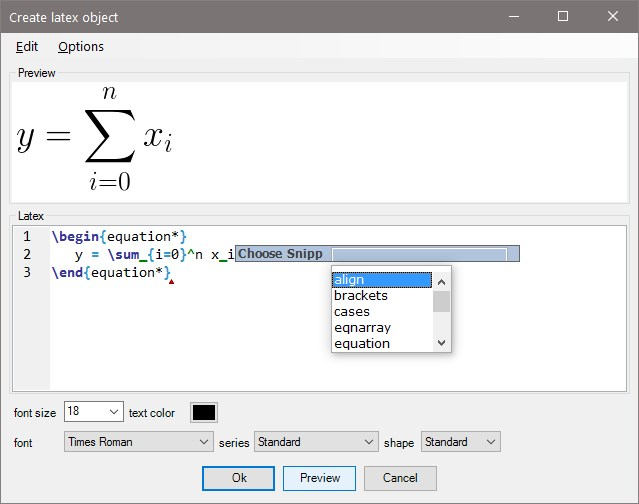

# Latex4CorelDRAW

This is a addon for CorelDRAW. It allows to add and edit Latex equations or symbols easily. The addon is based on ScintillaNET and supports syntax highlighting, code snippets etc.

The library was tested on Windows 10, CorelDRAW Graphics Suite 2021. 

**Author**: [Jan Bender](http://www.interactive-graphics.de), **License**: MIT

## Build Instructions

The included project file was made with Visual Studio 2019. You have to adapt the path of CorelDRAW in the project file Latex4CorelDraw.csproj if your CorelDRAW installation differs from "C:\Program Files\Corel\CorelDRAW Graphics Suite 2021".

## Installation

1. Download the latest release and extract the zip into C:\Program Files\Corel\CorelDRAW Graphics Suite 2021\Programs64\Addons to install the addon.
2. Right-click and open "Properties" for each DLL file in the folder. If you see the following text, you have to unblock the file:
"Security: This file came from another computer and might be blocked to help protect this computer."
3. Activate docker window "Latex" in the menu "Window" -> "Dockers".
3. If the generated latex equation looks somehow strange (as if the right fonts are missing), ensure that CorelDraw imports .ps files as "curves" and not as "text". This can be done by loading a .ps file manually since CorelDraw stores the last setting.
4. If you have a better solution for step 2, write me an email ;-)

## Screenshots

